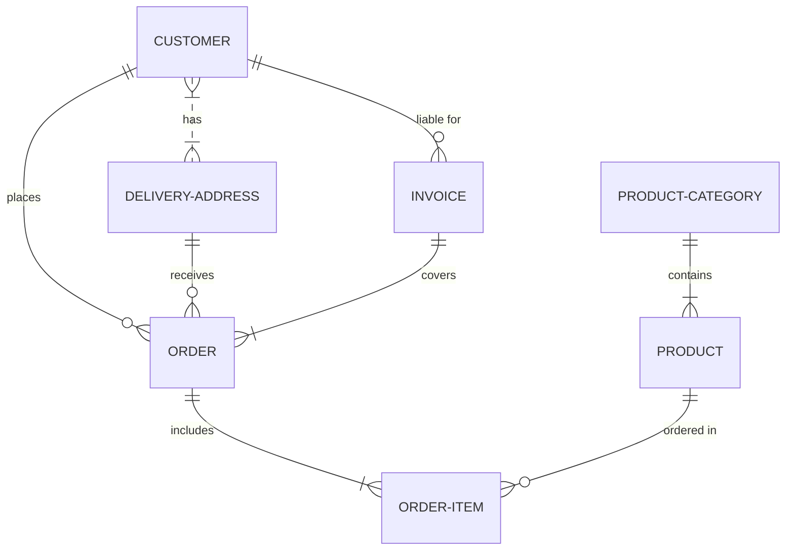

# Proyecto de Estudio!

# PRESENTACIÓN (Grupo 2 / Diseño e Implementación de una Base de Datos para un Negocio de Venta de Productos)

**Asignatura**: Bases de Datos I (FaCENA-UNNE)

**Integrantes**:
 - Fernandez Lezcano, Luciana Itati 
 - Coronas Almada, Priscila Jezabel 
 - Conti, Tomás Ariel 

**Año**: 2024

## CAPÍTULO I: INTRODUCCIÓN

### Caso de estudio

Maecenas molestie lacus tincidunt, placerat dolor et, ullamcorper erat. Mauris tortor nisl, ultricies ac scelerisque nec, feugiat in nibh. 

### Definición o planteamiento del problema

Pellentesque interdum aliquam magna sit amet rutrum. Nulla aliquam ligula nec quam iaculis dictum. In cursus aliquam cursus. Nullam a sem vel sapien iaculis finibus. Donec aliquam dictum viverra. Etiam ut orci lacus.

## CAPÍTULO IV: DESARROLLO DEL TEMA / PRESENTACIÓN DE RESULTADOS 

Maecenas molestie lacus tincidunt, placerat dolor et, ullamcorper erat. Mauris tortor nisl, ultricies ac scelerisque nec, feugiat in nibh. Pellentesque interdum aliquam magna sit amet rutrum. 

### Diagrama conceptual (opcional)
Ejemplo usando Live Editor https://mermaid.js.org/ (ejemplo opcional)

### Diagrama relacional

### Diccionario de datos

Acceso al documento [PDF](doc/diccionario_datos.pdf) del diccionario de datos.

## BIBLIOGRAFÍA DE CONSULTA

 1. List item
 2. List item
 3. List item
 4. List item
 5. List item

